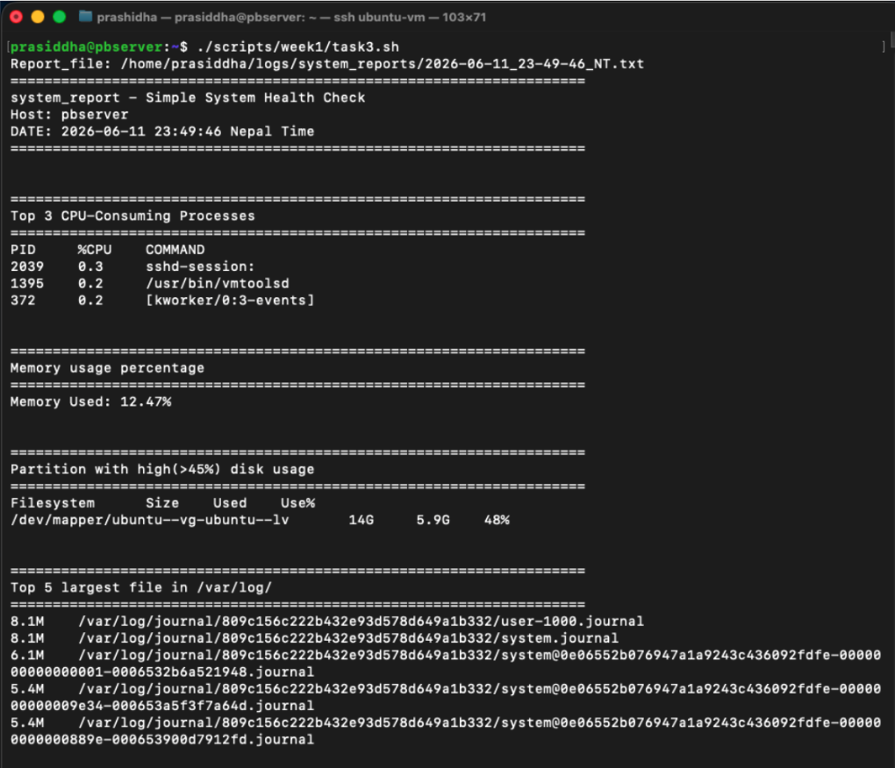
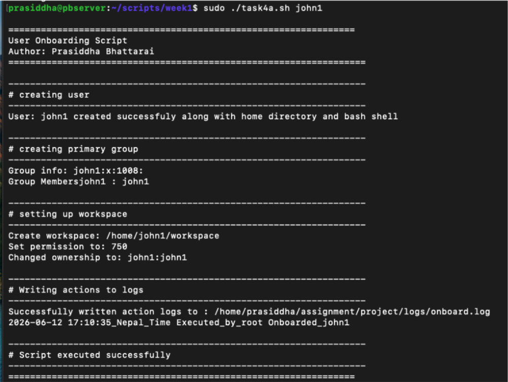
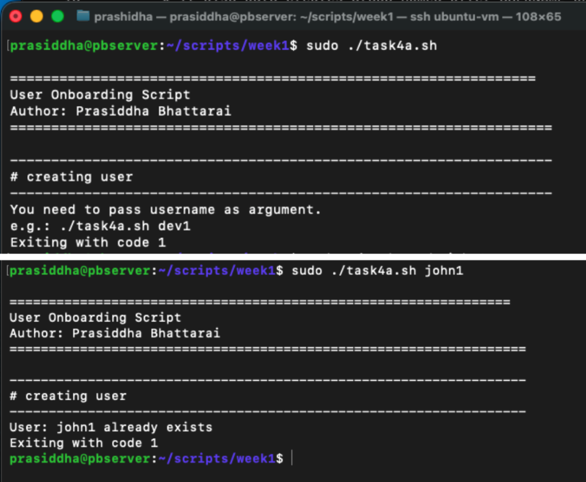
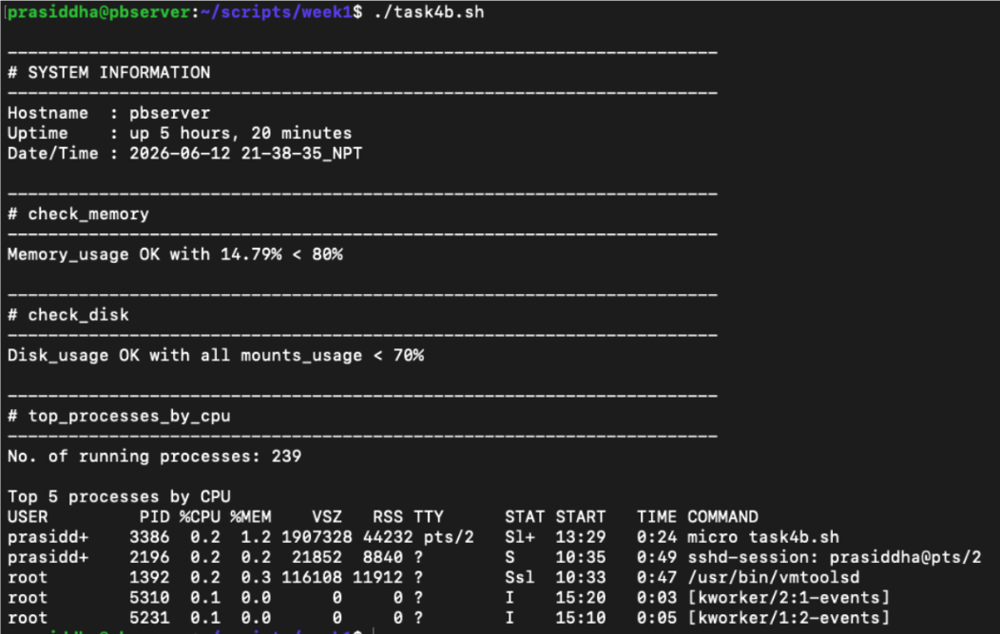
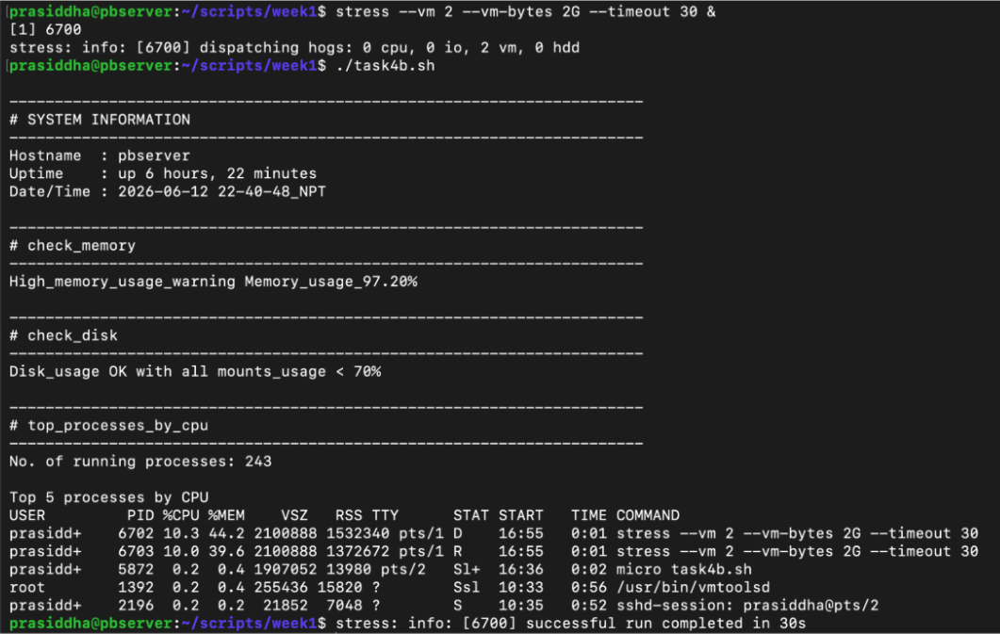
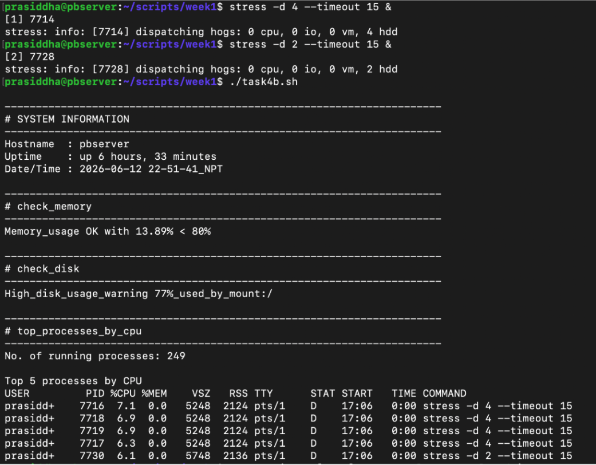

# Some useful bash scripts

## Contents
- [System_monitoring_script](#system_monitoring_script)
- [User_Onboarding_script](#user_onboarding_script)
- [System_health_check_script](#system_health_check_script)

 ## System_monitoring_script

 ```bash
 #!/bin/bash
# ============================================
# system_report - Simple System Health Check
# Author: [Prasiddha Bhattarai]
# ============================================

DATE_NOW=$(TZ="Asia/Kathmandu" date +"%Y-%m-%d %H:%M:%S")
DATE_FILE=$(TZ="Asia/Kathmandu" date +"%Y-%m-%d_%H-%M-%S_NT")
REPORT_FILE="/home/prasiddha/logs/system_reports/${DATE_FILE}.txt"
echo "Report_file: ${REPORT_FILE}"

echo "====================================================================" >> ${REPORT_FILE}
echo "system_report - Simple System Health Check" >> ${REPORT_FILE}
echo "Host: $(hostname)" >> ${REPORT_FILE}
echo "DATE: ${DATE_NOW} Nepal Time" >> ${REPORT_FILE}
echo "====================================================================" >> ${REPORT_FILE}

print_header() {
	echo -e "\n" >> ${REPORT_FILE}
	echo "====================================================================" >> ${REPORT_FILE}
	echo "$1" >> ${REPORT_FILE}	
	echo "====================================================================" >> ${REPORT_FILE}
}


# --- Top 2 CPU consuming processes ---
print_header "Top 3 CPU-Consuming Processes"
ps aux --sort=-%cpu | head -4 | awk '{print $2 "\t" $3 "\t" $11}' >> ${REPORT_FILE}


# --- Memory used percentage ---
print_header "Memory usage percentage"
free | awk -F " " 'NR==2 {PER = ($3/$2)*100 } NR==2 {printf "Memory Used: %.2f%%\n", PER }' >> ${REPORT_FILE}


# --- Partition using > 45% ---
print_header "Partition with high(>45%) disk usage"
df -h | awk -F " " 'NR==1 {print $1 "\t" $2 "\t" $3 "\t" $5} $5+0 > 45 {print $1 "\t" $2 "\t" $3 "\t" $5}' >> ${REPORT_FILE}
# "+0"=> converts leading(prefix) numeric part into number. But only prefix part


# --- Top 5 largest file in /var/log/ --
print_header "Top 5 largest file in /var/log/"
find /var/log/ -type f -exec du -ha {} + 2>/dev/null | sort -hr | head -5 >> ${REPORT_FILE}


cat ${REPORT_FILE}

 ```

#### Instead of redirecting each command
```bash
# Save original stdout
exec 3>&1

# Redirect stdout to report
exec > "$REPORT_FILE"

# ... rest of script ...

# Show report on terminal
cat "$REPORT_FILE" >&3
```

 ### Execution Screenshot
 

 ---

 <br>

 ## User_Onboarding_script

 ```bash
 #!/bin/bash

# default username is null if no argument passed
USERNAME="${1:-null}"

# worksapce directory info
DIR_PATH="/home/${USERNAME}/workspace"
DIR_PER=750

# log dir path
LOG_PATH="/home/prasiddha/assignment/project/logs/onboard.log"

# TimeStamp
TIMESTAMP="$(TZ="Asia/Kathmandu" date +"%Y-%m-%d %H:%M:%S_Nepal_Time")"


echo -e "\n================================================================"
echo "User Onboarding Script "
echo "Author: Prasiddha Bhattarai"
echo -e "=================================================================="


echo -e "\n------------------------------------------------------------------"
echo "# creating user "
echo "------------------------------------------------------------------"

# Throw error if username not passed as argument
if [ ${USERNAME} = "null" ]; then
	echo -e  "You need to pass username as argument. \ne.g.: ./task4a.sh dev1 \nExiting with code 1"
	exit 1
fi

# Check if username pre-exists, if not create one
if id ${USERNAME} >/dev/null 2>&1; then
	echo -e "User: ${USERNAME} already exists \nExiting with code 1"
	exit 1
  # creating user along with thiers home dir and bash shell
  # it also auto creates group named after USERNAME and adds user to it
elif sudo useradd -m -s /bin/bash ${USERNAME}; then
	echo "User: ${USERNAME} created successfuly along with home directory and bash shell"
else
	echo "failed to create user: ${USERNAME}"
	echo "......aborting the script"
	exit 1
fi


echo -e "\n------------------------------------------------------------------"
echo "# creating primary group "
echo "------------------------------------------------------------------"

#check if primary group exist for that user and also check its members
if echo -n "Group info: " && getent group ${USERNAME}; then
	echo -n "Group Members" && groups ${USERNAME}
  # create group if doen't exist
elif sudo groupadd ${USERNAME} && sudo gpasswd -a ${USERNAME} ${USERNAME}; then
	echo "Group created explicitly"
	echo -n "Group info: " && getent group ${USERNAME}
	echo -n "Group members: " && groups ${USERNAME}
else
	echo "Failed to create primary group for user: ${USERNAME}"
	echo "......aborting the script and performing cleanup"
	sudo userdel -r ${USERNAME}
	exit 1
fi


echo -e "\n------------------------------------------------------------------"
echo "# setting up workspace "
echo "------------------------------------------------------------------"

if mkdir -p ${DIR_PATH} && chmod ${DIR_PER} ${DIR_PATH} && chown ${USERNAME}:${USERNAME} ${DIR_PATH}; then
	echo -e "Create workspace: ${DIR_PATH} \nSet permission to: ${DIR_PER} \nChanged ownership to: ${USERNAME}:${USERNAME}"
else
	echo "filed to set up workspace: ${DIR_PATH}"
fi	


echo -e "\n------------------------------------------------------------------"
echo "# Writing actions to logs "
echo "------------------------------------------------------------------"

if echo "${TIMESTAMP} Executed_by_$(whoami) Onboarded_${USERNAME}" >> ${LOG_PATH}; then
	echo "Successfully written action logs to : ${LOG_PATH}"
	tail -n 1 ${LOG_PATH}
else
	echo "Failed to write action logs to : ${LOG_PATH}"
fi


echo -e "\n------------------------------------------------------------------"
echo "# Script executed successfully "
echo "------------------------------------------------------------------"

echo "================================================================"

 ```

 ### Execution Screenshot
 
 

 ---

<br>

 ## System_health_check_script

 ```bash
 #!/bin/bash

LOG_PATH="/home/prasiddha/assignment/project/logs/weekly/health_$(date +%Y_%m_%d).log"

FUNCTIONS=(check_memory check_disk top_processes_by_cpu)

print_header() {
	echo -e "\n----------------------------------------------------------------------" >> $LOG_PATH
	echo "# $1 " >> $LOG_PATH
	echo "----------------------------------------------------------------------" >> $LOG_PATH
	
}

# to check if memory usage, >80% fires warning in log
check_memory() {
	local MEM_USAGE=$(free | awk -F " " 'NR==2 {PER = ($3/$2)*100; printf "%.2f%%", PER; }')
	# cut is used to remove % symbol from MEM_USAGE
	if [ $(cut -d "." -f 1 <<< ${MEM_USAGE}) -gt 80 ]; then
		echo "High_memory_usage_warning Memory_usage_${MEM_USAGE}" >> $LOG_PATH
	else
		echo "Memory_usage OK with ${MEM_USAGE} < 80%" >> $LOG_PATH
	fi
}

# to check disk usage, > 70% use for any mount fires warning in log
check_disk() {
	#flag to track if any mount triggers warning
	local DISK_FLAG=0

	while read -r fs blocks used avail use mount; do
		# cut is used to remvoe % symbol from use
		if [[ $(cut -d "%" -f 1 <<< ${use}) -gt 70 ]]; then
			echo "High_disk_usage_warning ${use}_used_by_mount:${mount}" >> $LOG_PATH
			DISK_FLAG=$(($DISK_FLAG + 1))
		fi
	done < <(df)
	# <(command) => this is called process substitution
	# gives output of command as pseudo-file (like /dev/fd/63)

	# flag==0 means none of the mounts triggered disk warning
	if [ $DISK_FLAG -eq 0 ]; then
		echo "Disk_usage OK with all mounts_usage < 70%" >> $LOG_PATH
	fi
}

# print top 5 processes by CPU
top_processes_by_cpu() {
	{
	  echo "No. of running processes: $(ps aux --no-headers | wc -l)"
	  echo ""
	  echo "Top 5 processes by CPU"
	  ps aux --sort=-%cpu | head -n 6
	} >> $LOG_PATH
}


# Main Report Section
print_header 'SYSTEM INFORMATION' >> $LOG_PATH
echo "Hostname  : $(hostname)" >> $LOG_PATH
echo "Uptime    : $(uptime -p)" >> $LOG_PATH
echo "Date/Time : $(TZ="Asia/Kathmandu" date +"%Y-%m-%d %H-%M-%S_NPT")" >> $LOG_PATH

# call every function
for function in ${FUNCTIONS[@]}; do
	print_header "$function"
	$function
done

cat ${LOG_PATH}

 ```

 ### Execution Screenshot
 

 #### Simulating memory stres
 

 #### Simulating disk stress
 
